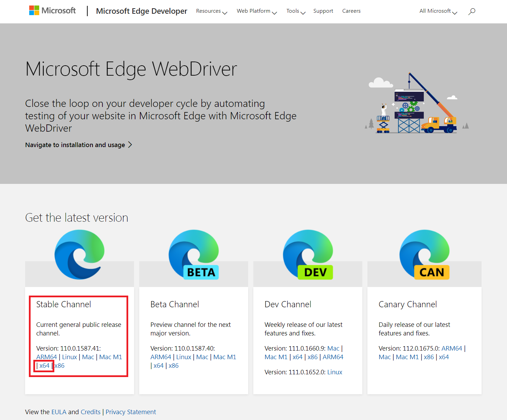
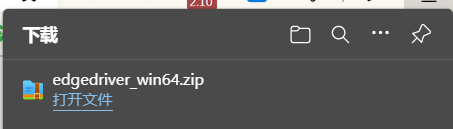
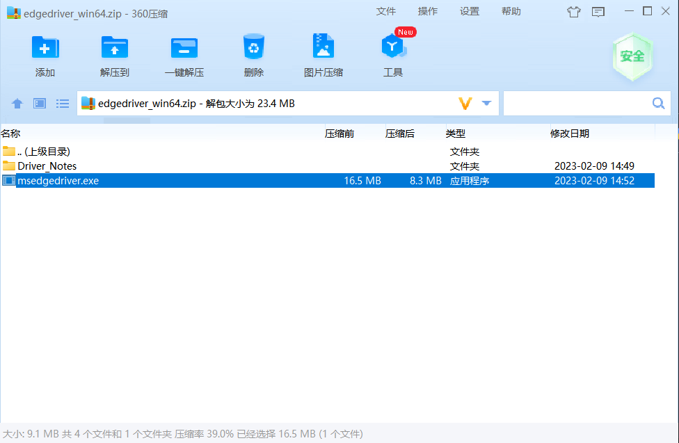
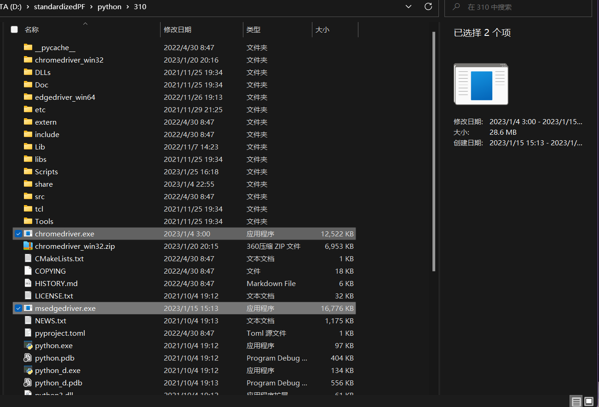

下载webdriver(（可能需要梯子) [Microsoft Edge WebDriver - Microsoft Edge Developer](https://developer.microsoft.com/en-us/microsoft-edge/tools/webdriver/)。一般的游戏本都是windows+64位系统，点x64就行。ARM芯片、Linux系统、Mac系统、M1芯片请选择其它。32位系统请选择x86。

  

  

  解压。把里面的msedgedriver.exe留下来，其他的可以全删。

  

  ctrl + X，ctrl + V放到你的python解释器安装目录下。

  

  

  

  同理，下载chromecriver.exe。网址是[ChromeDriver - WebDriver for Chrome (chromium.org)](https://chromedriver.chromium.org/)。